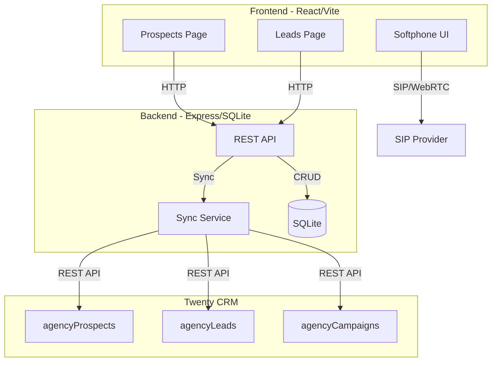

# twenty-dialer

A browser-based cold calling dialer with bidirectional sync to Twenty CRM. Designed for sales teams to manage outbound calling campaigns with prospects and leads.

[](https://opensource.org/licenses/MIT)
[](https://nodejs.org/)

---

## Overview

twenty-dialer is a self-hosted cold calling application that integrates seamlessly with Twenty CRM. It operates as an iframe within Twenty, providing:

- Browser-based softphone via SIP/WebRTC
- Prospect and lead lifecycle management
- Bidirectional sync with Twenty's `agencyProspects` and `agencyLeads`
- Call logging and script management
- Campaign organization

**Key distinction:** twenty-dialer uses a custom `coldCallStatus` field for manual cold calling workflows, separate from Twenty's built-in `outboundState` used by the automated SMS/video pipeline.

---

## Features

- **Browser Softphone** — WebRTC/SIP calling directly from the browser
- **Prospect Management** — Full CRUD for cold call targets
- **Lead Management** — Track converted prospects with detailed history
- **Campaign Organization** — Group calls by campaign
- **Call Logging** — Record outcomes, durations, and notes
- **Script Templates** — objection handling for common scenarios
- **Twenty CRM Sync** — Bidirectional sync with custom `coldCallStatus` field
- **CSV Import** — Bulk import prospects and leads
- **REST API** — Full API for integrations
- **Docker Support** — One-command deployment

---

## Architecture



### Data Flow

```
Create/Update Prospect
         ↓
   REST API (Express)
         ↓
   SQLite Database
         ↓
   Sync Service
         ↓
   Twenty CRM (agencyProspects)
```

---

## Status Mapping

twenty-dialer tracks manual calling outcomes via `coldCallStatus`, separate from the SMS pipeline:

| Status | Value | Meaning |
|--------|-------|---------|
| `new` | `NEW` | Fresh prospect, no contact made |
| `contacted` | `CONTACTED` | Initial contact made |
| `interested` | `INTERESTED` | Prospect showed interest |
| `not_interested` | `NOT_INTERESTED` | Prospect declined |
| `callback` | `CALLBACK` | Scheduled callback needed |
| `converted` | `CONVERTED` | Became a lead |
| `do_not_contact` | `DO_NOT_CONTACT` | DNC flagged |

---

## Quick Start

### Prerequisites

- Node.js 20+
- npm or pnpm
- Twenty CRM instance with `agencyProspects` and `agencyLeads` objects
- SIP provider (SignalWire, Telnyx, Twilio, or any SIP server)

### Installation

```bash
git clone https://github.com/matthewdonsemail-lab/open-twenty-dialer.git
cd open-twenty-dialer
```

### Backend Setup

```bash
cd backend
npm install
cp .env.example .env.local
# Edit .env.local with your configuration
npm run dev
```

### Frontend Setup

```bash
cd frontend
npm install
cp .env.example .env.local
# Edit .env.local with VITE_API_URL=http://localhost:4000
npm run dev
```

Open http://localhost:3000

### Docker Deployment

```bash
docker compose up -d
docker compose exec backend npm run seed
```

---

## Configuration

### Environment Variables

Create `.env.local` in the project root:

```env
# Twenty CRM
TWENTY_BASE_URL=https://twenty.inferencesaver.com/rest
TWENTY_API_KEY=your-api-key-here

# Sync Settings
SYNC_POLL_INTERVAL_MS=30000

# Backend
PORT=4000
JWT_SECRET=your-jwt-secret

# Frontend
VITE_API_URL=http://localhost:4000
VITE_SIP_URI=sip:your-extension@your-domain.sip.signalwire.com
VITE_SIP_PASSWORD=your-password
VITE_SIP_WS_URL=wss://your-domain.sip.signalwire.com
```

### SIP Configuration

Works with SignalWire, Telnyx, Twilio, Asterisk, FreeSWITCH, or any SIP server.

See [SIP Providers Guide](docs/sip-providers.md) for detailed setup.

---

## Project Structure

```
open-twenty-dialer/
├── backend/                    # Express API server
│   ├── src/
│   │   ├── db/                # SQLite schema + migrations
│   │   ├── middleware/        # Auth middleware
│   │   ├── routes/            # REST API routes
│   │   └── sync/              # Twenty CRM sync modules
│   │       ├── prospects.ts   # Prospect sync logic
│   │       ├── leads.ts       # Lead sync logic
│   │       └── inbound.ts     # Inbound sync pollers
│   └── scripts/               # Migration scripts
├── frontend/                   # React/Vite SPA
│   └── src/
│       ├── components/        # UI components
│       ├── pages/             # Route pages
│       └── lib/               # API client
├── docs/
│   └── okf/datamodel/         # OKF documentation
├── docker/                     # Docker configuration
└── .env.local                 # Environment config (gitignored)
```

---

## API Endpoints

### Authentication

| Method | Endpoint | Description |
|--------|----------|-------------|
| POST | `/api/auth/signup` | Create account |
| POST | `/api/auth/login` | Sign in |
| GET | `/api/auth/me` | Get current user |

### Prospects

| Method | Endpoint | Description |
|--------|----------|-------------|
| GET | `/api/prospects` | List all prospects |
| GET | `/api/prospects/:id` | Get single prospect |
| POST | `/api/prospects` | Create prospect |
| PATCH | `/api/prospects/:id` | Update prospect |
| DELETE | `/api/prospects/:id` | Delete prospect |
| POST | `/api/prospects/import` | Bulk import from CSV |

### Leads

| Method | Endpoint | Description |
|--------|----------|-------------|
| GET | `/api/leads` | List all leads |
| GET | `/api/leads/:id` | Get single lead |
| POST | `/api/leads` | Create lead |
| PATCH | `/api/leads/:id` | Update lead |
| DELETE | `/api/leads/:id` | Delete lead |

### Sync

| Method | Endpoint | Description |
|--------|----------|-------------|
| POST | `/api/sync/inbound` | Trigger manual inbound sync |
| GET | `/api/sync/status` | Get sync status |

---

## Roadmap

- [x] Prospect/lead management
- [x] Twenty CRM bidirectional sync
- [x] Custom `coldCallStatus` field
- [x] Campaign management
- [x] Call logging
- [ ] Audio device selector (mic/speaker)
- [ ] Call recording
- [ ] Parallel dialing (power dialer mode)
- [ ] Voicemail detection
- [ ] Webhook-based sync triggers
- [ ] AI-powered call summaries

---

## Development

### Running Tests

```bash
cd backend
npm test

cd frontend
npm test
```

### Linting

```bash
npm run lint
```

### Building

```bash
npm run build
```

---

## License

MIT License — see [LICENSE](LICENSE) for details.

---

## Documentation

- [Data Model](docs/okf/datamodel/open-cold-dialer.md) — Detailed architecture and sync documentation
- [SIP Providers Guide](docs/sip-providers.md) — Configure your SIP provider
- [Twenty CRM Integration](docs/twenty-integration.md) — Sync configuration guide
