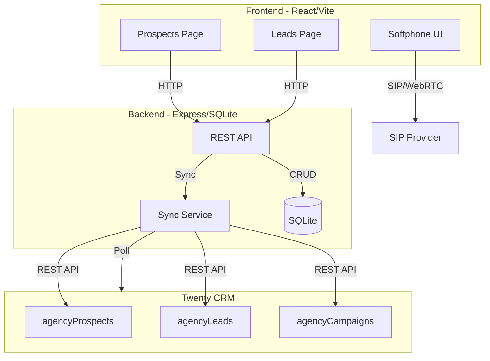
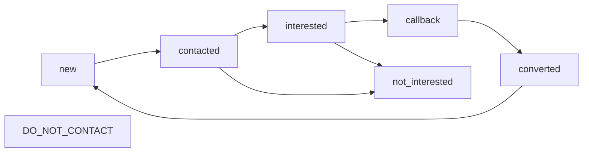
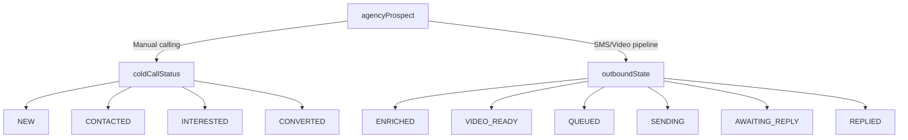
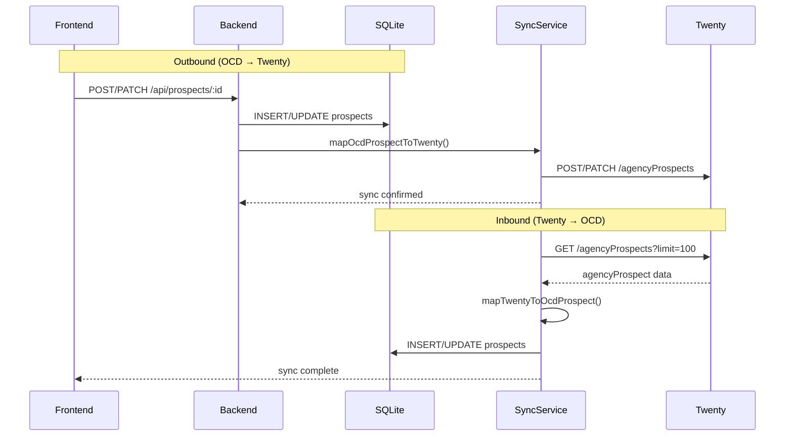

# Open Cold Dialer

A browser-based cold calling dialer that integrates with Twenty CRM for prospect and lead management. The system is designed to operate alongside the ui-kit's automated SMS/video pipeline, using a parallel `coldCallStatus` field for manual cold calling workflows.

## Purpose

Open-Cold-Dialer (OCD) serves the sales team's manual calling operations within Twenty CRM as an embedded iframe application. It provides:

- Browser-based softphone via SIP/WebRTC
- Prospect and lead management with full CRUD operations
- Bidirectional sync with Twenty CRM
- Call logging and script management
- Campaign organization

Unlike the ui-kit's automated SMS pipeline (`outboundState`), OCD uses its own `coldCallStatus` field to track manual calling outcomes separately.

## Architecture



## Data Model

### Local Database (SQLite)

#### prospects table

| Column | Type | Purpose |
|--------|------|---------|
| `id` | TEXT PRIMARY KEY | Local record identifier |
| `first_name` | TEXT | Contact first name |
| `last_name` | TEXT | Contact last name |
| `company` | TEXT | Company name |
| `phone` | TEXT | Primary phone number |
| `email` | TEXT | Primary email |
| `website` | TEXT | Company website |
| `address` | TEXT | Street address |
| `city` | TEXT | City |
| `state` | TEXT | State/region |
| `zip` | TEXT | ZIP/postal code |
| `status` | TEXT | Cold call status (see mapping below) |
| `source` | TEXT | Lead source |
| `campaign_id` | TEXT | Associated campaign |
| `assigned_to` | TEXT | Team member assigned |
| `tags` | TEXT | JSON array of tags |
| `notes` | TEXT | Call notes |
| `dnc` | INTEGER | Do-not-call flag |
| `last_contacted_at` | TEXT | Last contact timestamp |
| `contact_count` | INTEGER | Number of contacts made |
| `sync_id` | TEXT | Link to Twenty externalId |
| `created_at` | TEXT | Record creation time |
| `updated_at` | TEXT | Record update time |

#### leads table

Similar structure to prospects, with `last_called_at` and `call_count` instead of `last_contacted_at` and `contact_count`.

#### campaigns table

Stores outbound calling campaigns with name, description, and associated phone numbers.

#### call_logs table

Records individual call events with outcome, duration, and recording URL.

### Twenty CRM Objects

#### agencyProspects

Synced from OCD's `prospects` table. Custom `coldCallStatus` field tracks manual calling workflow.

| Twenty Field | OCD Field | Purpose |
|--------------|-----------|---------|
| `slug` | auto-generated | URL-safe identifier |
| `name` | `first_name` + `last_name` | Contact name |
| `phone` | `phone` | Phone number |
| `fullAddress` | `address`, `city`, `state`, `zip` | Full address |
| `city` | `city` | City |
| `region` | `state` | State/region |
| `country` | hardcoded | Country code (US) |
| `niche` | `source` | Lead source |
| `website` | `website` | Company website |
| `email` | `email` | Email address |
| `externalId` | `sync_id` | Record linkage |
| `coldCallStatus` | `status` | **Custom field** for cold calling |
| `outboundState` | n/a | Reserved for SMS pipeline |

#### agencyLeads

Synced from OCD's `leads` table. Uses both built-in `status` (for SMS pipeline compatibility) and custom `coldCallStatus`.

| Twenty Field | OCD Field | Purpose |
|--------------|-----------|---------|
| `contactName` | `first_name` + `last_name` | Contact name |
| `email` | `email` | Email address |
| `phone` | `phone` | Phone number |
| `source` | `source` | Lead source |
| `status` | `status` | Built-in status (NEW/CONTACTED/etc.) |
| `coldCallStatus` | `status` | **Custom field** for cold calling |
| `outboundMessage` | `sync_id` | Record linkage |
| `note` | `notes` | Call notes |

## Status Mapping

### Cold Calling Workflow

The `coldCallStatus` field tracks the manual calling lifecycle:



### Status Values

| OCD Status | Twenty coldCallStatus | Meaning |
|------------|----------------------|---------|
| `new` | `NEW` | Fresh prospect, no contact made |
| `contacted` | `CONTACTED` | Initial contact made |
| `interested` | `INTERESTED` | Prospect showed interest |
| `not_interested` | `NOT_INTERESTED` | Prospect declined |
| `callback` | `CALLBACK` | Scheduled callback needed |
| `converted` | `CONVERTED` | Became a lead/customer |
| `do_not_contact` | `DO_NOT_CONTACT` | DNC flagged |

### Distinction from SMS Pipeline



**Key difference:** `coldCallStatus` is for human-driven cold calling. `outboundState` is for automated SMS/video sequences. They operate independently.

## Sync Architecture

### Bidirectional Sync Flow



### Sync Implementation

**Outbound sync** (`backend/src/sync/prospects.ts`):
- `mapOcdProspectToTwenty()` converts OCD format to Twenty format
- Creates `coldCallStatus` with UPPER_CASE values
- Stores `sync_id` in `externalId` field for linking
- Handles create, update, delete operations

**Inbound sync** (`backend/src/sync/inbound.ts`):
- `pollProspects()` fetches from Twenty every `SYNC_POLL_INTERVAL_MS`
- `mapTwentyToOcdProspect()` converts Twenty format back to OCD
- Matches records by `externalId` (sync_id) or email
- Updates only changed fields

### Sync Configuration

Environment variables in `.env.local`:

```env
TWENTY_BASE_URL=https://twenty.inferencesaver.com/rest
TWENTY_API_KEY=your-api-key
SYNC_POLL_INTERVAL_MS=30000
```

## API Endpoints

### Prospects

| Method | Endpoint | Description |
|--------|----------|-------------|
| GET | `/api/prospects` | List all prospects |
| GET | `/api/prospects/:id` | Get single prospect |
| POST | `/api/prospects` | Create prospect |
| PATCH | `/api/prospects/:id` | Update prospect |
| DELETE | `/api/prospects/:id` | Delete prospect |
| POST | `/api/prospects/import` | Bulk import prospects |

### Leads

| Method | Endpoint | Description |
|--------|----------|-------------|
| GET | `/api/leads` | List all leads |
| GET | `/api/leads/:id` | Get single lead |
| POST | `/api/leads` | Create lead |
| PATCH | `/api/leads/:id` | Update lead |
| DELETE | `/api/leads/:id` | Delete lead |

### Sync

| Method | Endpoint | Description |
|--------|----------|-------------|
| POST | `/api/sync/inbound` | Trigger manual inbound sync |
| GET | `/api/sync/status` | Get sync status |

## Integration with ui-kit

Open-Cold-Dialer extends the ui-kit's Twenty CRM integration:

- Uses same `agencyProspects` and `agencyLeads` objects
- Adds custom `coldCallStatus` field for cold calling workflow
- Complements the SMS pipeline (`outboundState`) rather than replacing it
- Designed to be embedded in Twenty as an iframe for sales team use

### Related ui-kit Modules

- `lib/template-sites/client.ts` — Twenty metadata queries
- `lib/template-sites/schema.ts` — AgencyProspect type definitions
- `packages/lead-pipeline/` — State machines for enrichment and outbound workflows

## Future Enhancements

- [ ] Audio device selector (mic/speaker)
- [ ] Call recording integration
- [ ] Voicemail detection
- [ ] Parallel dialing (power dialer mode)
- [ ] Webhook-based sync triggers
- [ ] AI-powered call summaries
